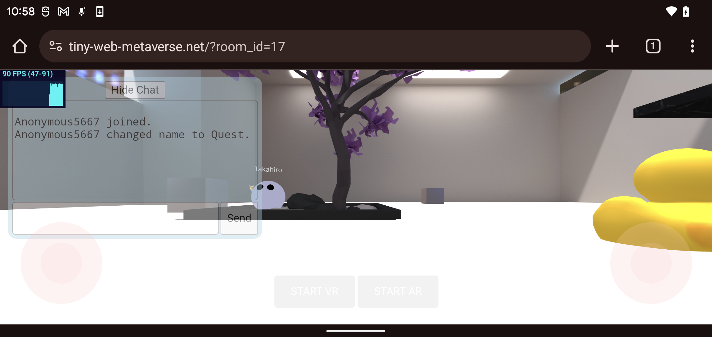
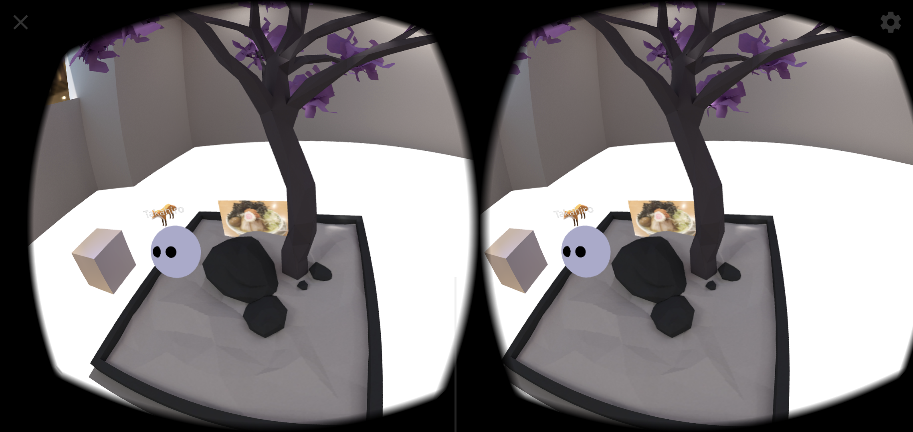
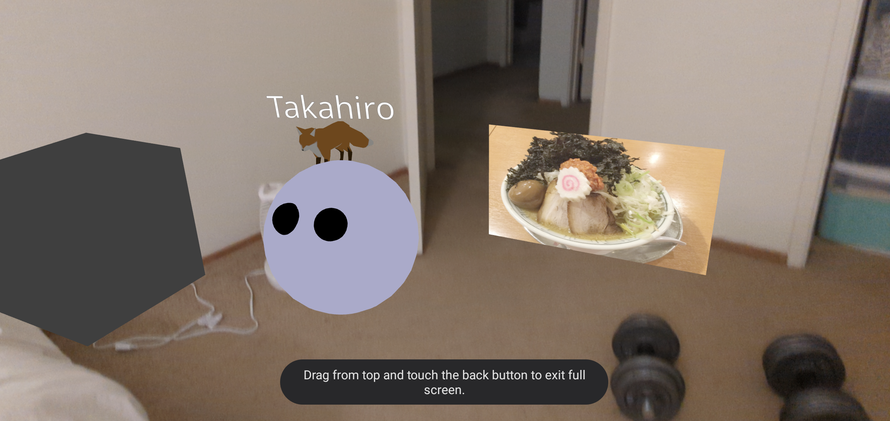

# Tiny Web Metaverse

Tiny Web Metaverse is a Web-based multi-user 3D virtual space framework with
high flexibility and extensibility. It is built on web standards, making it
familiar and easy to use for developers with Web development experience.

Tiny Web Metaverse adopts an ECS architecture. This architecture makes it
easy to add or modify features without having to modify existing code.

Tiny Web Metaverse uses Docker containers to reduce the overhead of environment
setup.

## Online Demo

[Online Demo](https://tiny-web-metaverse.net)

Click to enter a room, and then share the URL (with `?room_id=xxx`) with your 
friends to meet up with in a room.

Built on this framework, this demo offers the following features:

* 3D Exploration: Walk around and rotate the 3D space
* Collaborative Object Manipulation: Collaborate with remote users to manipulate
  objects in the 3D space
* Audio and Text Chat: Communicate with remote users via audio or text
* Mobile-Friendly: Good support for mobile devices
* VR/AR Experience: Experience the 3D space in a realistic way using VR/AR
  devices
* AI Model Generation: Generate 3D models automatically using generative AI

## Screenshots

<br />
<br />


## What this framework provides

This framework makes it easy to create and deploy multiplayer virtual 3D space
web apps that reflect user ideas in a free way, with its ease of adding custom
features and self-hosting.

The advent of [WebGL](https://developer.mozilla.org/en-US/docs/Web/API/WebGL_API)
and [WebGPU](https://developer.mozilla.org/en-US/docs/Web/API/WebGPU_API), as
well as JavaScript 3D graphics libraries that use them, has made 3D rendering
easier in browsers. Also, [WebXR](https://developer.mozilla.org/en-US/docs/Web/API/WebXR_Device_API),
[WebSocket](https://developer.mozilla.org/en-US/docs/Web/API/WebSockets_API), and
[WebRTC](https://webrtc.org/) have made it possible to create web apps with
VR/AR, and real-time network processing.

Many people are interested in developing multiplayer virtual 3D space web apps
that could be used to create applications that realize new forms of human
interaction, such as open online games and virtual events.

However, developing them can be surprisingly laborious. You need to develop
both the client and the server, and you need knowledge of hosting and Web APIs.
Network synchronization is especially troublesome. These processes can be
cumbersome.

There are ways to use existing platforms to create custom content, but they can
be restrictive, as custom logic can be difficult to add, and you may need to
register with the platform.

To address these challenges, I created a framework that is easy to modify, extend,
and self-host.

The framework handles the cumbersome processing of the above Web APIs,so you can
focus on your own custom logic and content creation. It is also built on
technologies that are commonly used in web app development, such as
[JavaScript](https://developer.mozilla.org/en-US/docs/Web/JavaScript) and
[TypeScript](https://www.typescriptlang.org/), so you can develop with a familiar
development environment and workflow.

## Features

* Extendibility and flexibility with [ECS architecture](https://en.wikipedia.org/wiki/Entity_component_system)
* Easy self-hosting with [Docker](https://www.docker.com/)
* VR/AR support with [WebXR](https://developer.mozilla.org/en-US/docs/Web/API/WebXR_Device_API)
* Real-time network synchronization with [WebSocket](https://developer.mozilla.org/en-US/docs/Web/API/WebSockets_API)
* Real-time Audio/Video communication with [WebRTC](https://webrtc.org/)
* Audio effects with [WebAudio](https://developer.mozilla.org/en-US/docs/Web/API/Web_Audio_API)
* Support for mobile devices
* Accelerates development with standard Web technologies

## Architecture overview

Client:

- 3D graphics rendering using WebGL
- VR/AR processing using WebXR, such as positional tracking
- Network synchronization of object states with remote clients using WebSockets
  via State server
- Audio and video communication with remote clients using WebRTC via Stream
  server
- Input handling from input devices such as mouse, keyboard, touchscreen,
  VR headset, and so on

Stream server:

- SFU WebRTC server for client-to-client audio and video communication
- Reduces the burden on the publisher, and also saves the number of WebRTC
  connections

State server:

- A Pub/Sub server for synchronizing object state between clients
- Adopts a Pub/Sub architecture, which makes it loosely coupled and scalable

Database:

- Used by the state server to store object state


## Sub-projects

This project consists of the sub projects. See `packages` directory.

* [addons](https://github.com/takahirox/tiny-web-metaverse/tree/main/packages/addons): Addons for Client
* [client](https://github.com/takahirox/tiny-web-metaverse/tree/main/packages/client): Client
* [examples](https://github.com/takahirox/tiny-web-metaverse/tree/main/packages/examples): Demo
* [state_client](https://github.com/takahirox/tiny-web-metaverse/tree/main/packages/state_client): Client of State server
* [state_server](https://github.com/takahirox/tiny-web-metaverse/tree/main/packages/state_server): State server
* [stream_client](https://github.com/takahirox/tiny-web-metaverse/tree/main/packages/stream_client): Client of Stream server
* [stream_server](https://github.com/takahirox/tiny-web-metaverse/tree/main/packages/stream_server): Stream server

## How to add custom logic

See [the Readme of Client](https://github.com/takahirox/tiny-web-metaverse/tree/main/packages/client)

## How to build

```sh
$ git clone https://github.com/takahirox/tiny-web-metaverse.git
$ cd tiny-web-metaverse
$ npm run install:all
$ npm run build:all
```

## How to run Demo locally

Prerequirements:

* Install [PostgreSQL](https://www.postgresql.org/)
  * Setup User/Password as postgres/postgres
* Install [Elixir](https://elixir-lang.org/)
* [Build the project](#how-to-build)

```sh
# Terminal 1
$ cd packages/stream_server
$ npm run server

# Terminal 2
$ cd packages/state_server
$ mix deps.get
$ mix deps.compile
$ mix ecto.create
$ mix ecto.migrate
$ mix phx.server

# Terminal 3
$ cd packages/examples
$ npm run server
```

And access http://localhost:8080 on your browser.

## How to run Demo locally with Docker

Prerequirements:

* Install [Docker](https://www.docker.com/)

```sh
$ ./Dockerfiles/up.sh
```

And access http://localhost:8080 on your browser.

## Deploy Demo to AWS ECS with Docker

See [the Deploy Demo to AWS ECS with Docker document](./docs/deploy/aws.md).

## Deploy Demo to Google Cloud

T.B.D.

## How to support the project

* Test and [Report bugs](https://github.com/takahirox/tiny-web-metaverse/issues)
* [Make Pull requests](https://github.com/takahirox/tiny-web-metaverse/pulls) to fix bugs or add new features
* Monthly or one-time support via GitHub sponsors: T.B.D.
* Make a support contract: T.B.D.
