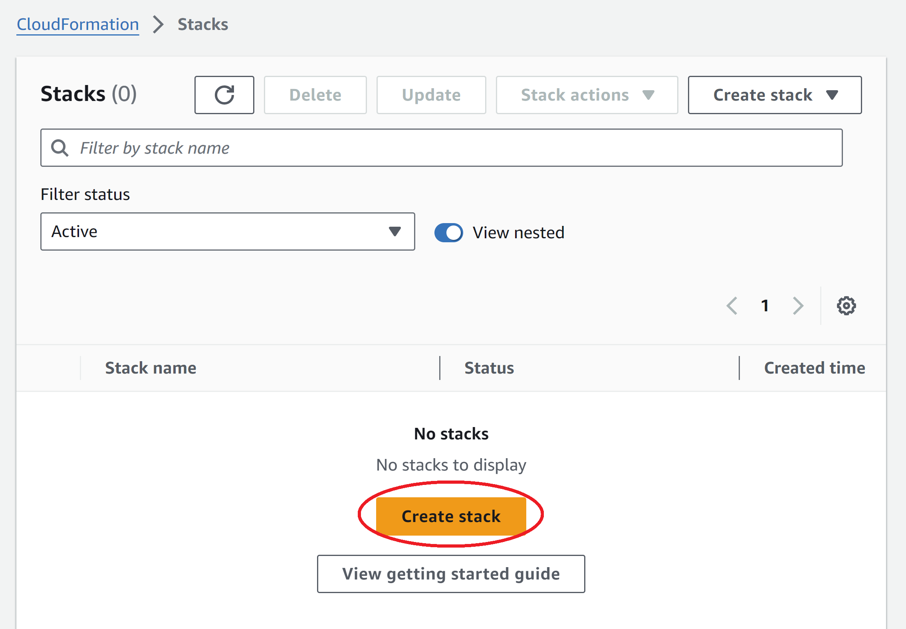
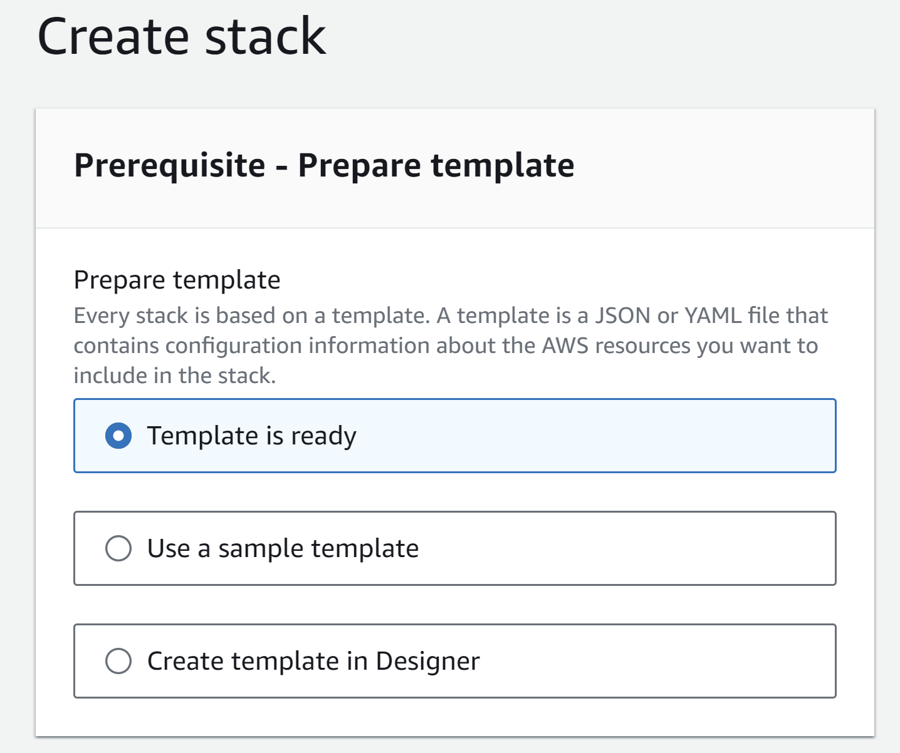
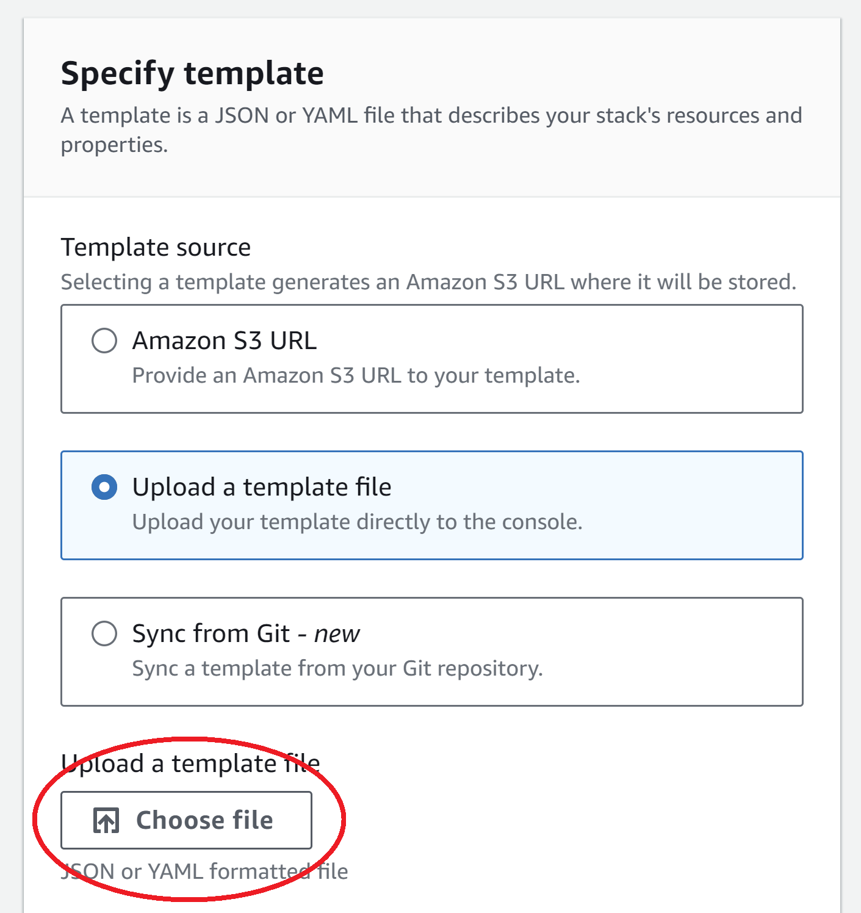
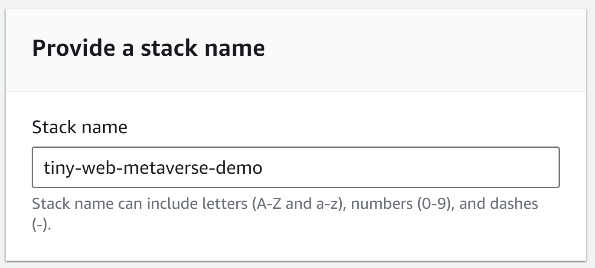
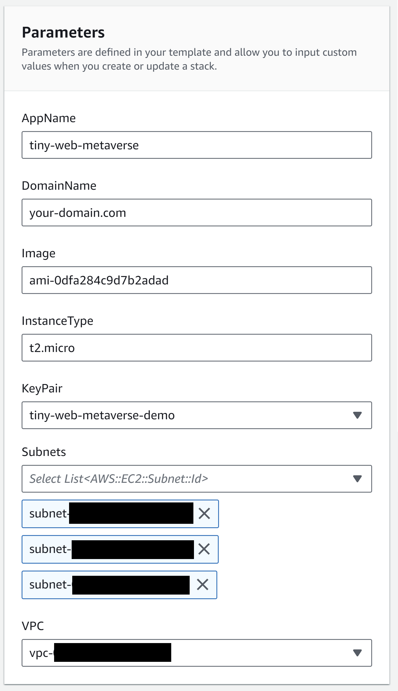
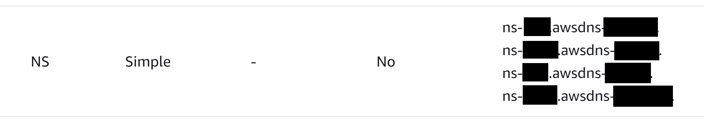

# Deploy to AWS ECS

The goal of this document is to help readers understand how to deploy Tiny Web
Metaverse application on AWS.

## Prerequirements

* Get your own domain name (eg: [Amazon Route 53](https://aws.amazon.com/getting-started/hands-on/get-a-domain/))
* [Make an AWS account](https://aws.amazon.com/)
* [Login to AWS Management console](https://aws.amazon.com/console/)
* [Create and download a key pair at AWS EC2 console](https://console.aws.amazon.com/ec2/)
* Optional: [Create VPC and subnets if needed at AWS VPC if needed](https://console.aws.amazon.com/vpc/)
  * Default ones created when opening an AWS account are also ok.

## Set up AWS resources

Open Create stack page

* Go to [AWS CloudFormation console](https://console.aws.amazon.com/cloudformation/)
* Click "Create stack" button



In Step 1: Create stack

* Select "Template is ready" in Prepate template
* Select "Upload a template file", Click "Choose file", and upload [tiny-web-metaverse/deploy/aws.yaml](../../../deploy/aws.yaml) in Template source
* Click "Next" button
  



In Step 2: Specify stack details

* Stack name: Any. Eg. tiny-web-metaverse-demo
* AppName: Any. Eg. tiny-web-metaverse
* DomainName: Your domain name you created in advance. Eg. your-domain.com    
* Image: Find enter AMI 2023 Image ID. Using the default one would be ok.
* InstanceType: Any Eg. t2.micro ([for free to use](https://aws.amazon.com/free/))
* KeyPair: Choose the one you created in advance
* Subnets: Choose the ones you created in advance or the default ones
* VPC: Choose the one you created in advance or the default one
* Click "Next" button




In Step 3: Configure stack options

* Adjust configuration if you needed
* Click "Next" button

In Step 4: Review

* Click "Create change set" button

Create change set dialog

* Change set name: Any. Eg. tiny-web-metaverse-demo
* Click "Create change set" button

In change set page

* Wait until Execution status will be Available (Click reload button if needed)
* Click "Execute change set" button

Execute change set? dialog

* Adjust configuration if needed
* Click "Execute change set" button
* Wait until CREATE_COMPLETE status

Executing change set may take time, especially Certificate verification task.

If Certificate validation never ends, updating name server configuration in
the web domain name registrar service you used to get the domain name may be
needed.

* Go to [AWS Route53 console](https://console.aws.amazon.com/route53/)
* Click Hosted zones
* Click your domain name in the list
* Find NS type record and remember the name servers
* Update the name servers in the domain name registrar service

Please ask the domain name registrar service for how to update name servers.



## Login to EC2 instance

Copy the downloaded key pair file (called `foo.pem` here) to `~/.ssh`.

```sh
$ cp Downloads/foo.pem ~/.ssh/
```

Login to the instance by using the EC2 instance public domain name found in
[AWS EC2 console - Instances - Instance](https://console.aws.amazon.com/ec2/).

Here, assume it is `ec2-01-234-567-890.ap-northeast-1.compute.amazonaws.com`.

```sh
$ ssh -i ~/.ssh/foo.pem ec2-user@ec2-01-234-567-890.ap-northeast-1.compute.amazonaws.com
```

## Install Docker

```sh
$ sudo dnf update
$ sudo dnf install docker
$ sudo systemctl enable --now docker
$ sudo usermod -aG docker ec2-user
$ id

# Exit and login again
$ exit
$ ssh -i ~/.ssh/foo.pem ec2-user@ec2-01-234-567-890.ap-northeast-1.compute.amazonaws.com

$ docker info
```

## Install Docker compose

```sh
$ sudo mkdir -p /usr/local/lib/docker/cli-plugins/
$ sudo curl -SL https://github.com/docker/compose/releases/download/v2.22.0/docker-compose-linux-x86_64 -o /usr/local/lib/docker/cli-plugins/docker-compose
$ sudo chmod +x /usr/local/lib/docker/cli-plugins/docker-compose
```

Find the latest or preferred package version from https://github.com/docker/compose/releases/

## Install Git

```sh
$ sudo dnf install git
```

## Optional: Setup Swap space

Consider to setup swap space if using low memory instance like free tier instances
(t2.micro or t3.micro).

```sh
$ sudo dd if=/dev/zero of=/swapfile bs=1M count=4096
$ sudo chmod 600 /swapfile
$ sudo mkswap /swapfile
$ sudo swapon /swapfile
$ sudo swapon -s
$ sudo vi /etc/fstab
# Add /swapfile swap swap defaults 0 0
```

## Deploy

Prerequirements:
- Know the IP address of your domain name
(eg: with `Linux dig command` or [DNS lookup web sites](https://www.nslookup.io/))

TODO: IP address can change, for example when rebooting the instance. Use Elastic IP?

### Deploy the demo

If you want to deploy the demo [`tiny-web-metaverse/packages/examples`](../../../packages/examples),
login to the instance, clone the repository, and run `docker compose up`
command in the instance.

```sh
$ ssh -i ~/.ssh/foo.pem ec2-user@ec2-01-234-567-890.ap-northeast-1.compute.amazonaws.com
$ git clone https://github.com/takahirox/tiny-web-metaverse.git
$ cd tiny-web-metaverse
$ MEDIASOUP_ANNOUNCED_IP=your_ip_address docker compose up
```

### Deploy your application

If you want to deploy your application, write `Dockerfile` and
`docker-compose.yaml` like the followings in your application directory
and push the files into your repository. Assuming that your application is
managed at GitHub repository.

```
# syntax=docker/dockerfile:1

# Dockerfile

FROM node:latest
WORKDIR /app
COPY . .
RUN npm install
# Assuming "npm run build" for building your application and
# "npm run server" for booting the web server at 8080 port.
CMD npm run build && \
    npm run server
```

```
# docker-compose.yaml

services:
  app:
    build:
      context: .
      dockerfile: Dockerfile
    ports:
      - "8080:8080"
```

After that login to the instance, clone the Tiny Web Metaverse repository, and
run the servers (`database`, `state_server`, and `stream_server`) services.

```sh
$ ssh -i ~/.ssh/foo.pem ec2-user@ec2-01-234-567-890.ap-northeast-1.compute.amazonaws.com
$ git clone https://github.com/takahirox/tiny-web-metaverse.git
$ cd tiny-web-metaverse
$ MEDIASOUP_ANNOUNCED_IP=your_ip_address docker compose up database state_server stream_server
```

And then on another terminal window login to the instance, clone your
application repository, and run the Web server service.

```sh
$ ssh -i ~/.ssh/foo.pem ec2-user@ec2-01-234-567-890.ap-northeast-1.compute.amazonaws.com
$ git clone https://github.com/yourname/your-application.git
$ cd your-application
$ docker compose up
```

Please refer to [the "Getting Started" document](../../development/getting_started.md)
for how to create your application with Tiny Web Metaverse framework.

### Access the web server

Once the services are ready, access https:// + your domain name (Eg.
https://yourdomain.com if your domain name is "yourdomain.com") on web browser.

## Running cost estimation

T.B.D.
