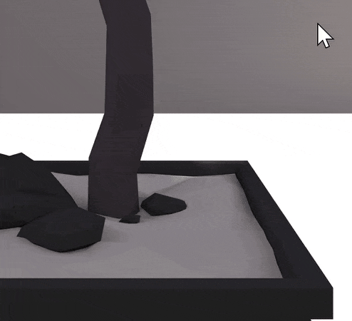
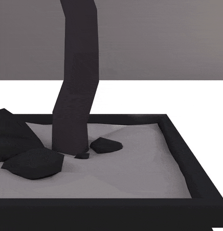

# Tiny Web Metaverse Getting Started

The goal of this document is to help readers understand how to develop Tiny
Web Metaverse applications and run them locally.

## Client core concept

Please refer to [the Client Core concept document](https://github.com/takahirox/tiny-web-metaverse/tree/main/packages/client)
as needed for a deeper understanding.

## Prerequisites

This document assumes that readers have the following prerequisites:

* Basic knowledge of [JavaScript](https://developer.mozilla.org/en-US/docs/Web/JavaScript)/[TypeScript](https://www.typescriptlang.org/)
* Basic knowledge of [Three.js](https://threejs.org/)
* Basic knowledge of [using npm](https://www.npmjs.com/)
* Basic knowledge of creating JavaScript bundle files

It is also helpful to have the following knowledge:

* Basic knowledge of [ECS architecture](https://en.wikipedia.org/wiki/Entity_component_system)
* Basic knowledge of [bitECS](https://github.com/NateTheGreatt/bitECS)

## Run the Stream and State servers

First, you need to start the [Stream server](https://github.com/takahirox/tiny-web-metaverse/tree/main/packages/stream_server) and
[State server](https://github.com/takahirox/tiny-web-metaverse/tree/main/packages/state_server).
The easiest way is to use the default ones.

Prerequirements:

* Install [PostgreSQL](https://www.postgresql.org/)
  * Setup User/Password as postgres/postgres
* Install [Elixir](https://elixir-lang.org/)

```sh
$ git clone https://github.com/takahirox/tiny-web-metaverse.git
$ cd tiny-web-metaverse
$ npm run install

# terminal 1

$ cd packages/stream_server
$ npm install
$ npm run build
$ npm run server

# terminal 2

$ cd packages/state_server
$ mix deps.get
$ mix deps.compile
$ mix ecto.create
$ mix ecto.migrate
$ mix phx.server
```

## Application files and directory structure

The following directory structure and configuration files are assumed for creating
an application. We assume that you will use [webpack](https://webpack.js.org/) as
the JavaScript bundler and web server, but you can use any other tool you like.
In that case, please adjust the following code examples as needed. Please also
update the versions of the dependencies packages as needed.

```
- index.html
- tsconfig.json
- package.json
- webpack.config.js
- assets/
- types/ (copy from https://github.com/takahirox/tiny-web-metaverse/tree/main/types)
- src/
  - index.ts
```

TODO: Avoid to copy https://github.com/takahirox/tiny-web-metaverse/tree/main/types

```json
// package.json

{
  "dependencies": {
    "bitecs": "^0.3.40",
    "three": "^0.152.2",
    "@tiny-web-metaverse/addons": "^0.0.1",
    "@tiny-web-metaverse/client": "^0.0.1"
  },
  "devDependencies": {
    "@types/three": "^0.152.1",
    "ts-loader": "^9.4.2",
    "typescript": "^4.9.5",
    "webpack": "^5.89.0",
    "webpack-cli": "^5.1.4",
    "webpack-dev-server": "^4.15.1"
  },
  "scripts": {
    "build": "webpack",
    "server": "webpack serve"
  }
}
```

```json
// tsconfig.json

{
  "compilerOptions": {
    "esModuleInterop": true,
    "module": "es6",
    "moduleResolution": "node",
    "noImplicitAny": true,
    "noImplicitReturns": true,
    "noUnusedLocals": true,
    "noUnusedParameters": true,
    "target": "es6",
    "typeRoots": [
      "./node_modules/@types",
      "./types"
    ]
  },
  "exclude": [
    "node_modules"
  ]
}
```

```javascript
// webpack.config.js

const path = require('path');
const webpack = require('webpack');

const mode = 'development';

module.exports = [
  {
    devServer: {
      port: 8080,
      static: {
        directory: path.join(__dirname),
      }
    },
    devtool: 'source-map',
    entry: './src/index.ts',
    mode: mode,
    module: {
      rules: [
        {
          test: /\.tsx?$/,
          loader: 'ts-loader',
          options: {
            allowTsInNodeModules: true
          }
        }
      ]
    },
    output: {
      filename: 'app.bundle.js',
      path: path.resolve(__dirname, 'dist')
    },
    resolve: {
      extensions: [
        '.js',
        '.ts',
        '.tsx'
      ]
    }
  }
];
```

```html
<!-- index.html -->

<!DOCTYPE html>
<html lang="en">
<head>
  <title>Tiny Web Metaverse app</title>
  <meta name="viewport" content="width=device-width, user-scalable=no, minimum-scale=1.0, maximum-scale=1.0">
  <style>
    body {
      margin: 0;
      background-color: #000;
      color: #fff;
      overscroll-behavior: none;
    }
  </style>
</head>
<body>
  <script type="module">
    import "./dist/app.bundle.js";
  </script>
</body>
</html>
```

## First App

Let's create an application. Let's start with a minimal one.

```typescript
// src/index.ts

import { App } from "@tiny-web-metaverse/client/src";

const roomId = '1234';
const canvas = document.createElement('canvas');

const app = new App({ canvas, roomId });
document.body.appendChild(canvas);

app.start();
```

`App` is a class for Tiny Web Metaverse application. `App.start()` starts an
application.

The `App` constructor takes a `HTMLCanvasElement` for rendering and a room id.
Only users in the same room can see each other and have voice conversations.

Once you have written your first application, build and run the application web
server.

```sh
$ npm install
$ npm run build
$ npm run server
```

And then access [http://localhost:8080](http://localhost:8080) on your web
browser.

Congratulations! Your first application is up and running. You may be confused
that nothing is displayed, but that's okay. You have not implemented any
features yet. Let's start adding features one by one from now on.

## Add a room object to Scene

Let's place a room object in the 3D scene. Tiny Web Metaverse has the ability
to load [glTF](https://www.khronos.org/gltf/) files. Find a free glTF/glb file
that looks like a room on the internet and save it as `assets/scene.glb`.

Then update `src/index.ts` to add the code to place the object. Create a new
Entity and add the built-in `GltfLoader`, `InScene`, and `SceneObject`
components. Set the path to the glb file to the `GltfLoaderProxy`.

`GltfLoader` component will drive the built-in systems to load the glb file,
parse the content, generate a Three.js objects, and add them to the Scene.
`GltfLoaderProxy` is used for assigning non-number value to `GltfLoader`
component. `InScene` component will drive the built-in system to add the
Three.js objects associated to the entity to the 3D scene. `SceneObject`
component is for indicating that Three.js objects associated to the entity
is scene objects and can be used for processing scene objects (or non-scene
objects) in some systems.

Similarly, create another entity and setup light.

For more information on Entity, Component, ComponentProxy, and System refer to
[the Client core concept document](https://github.com/takahirox/tiny-web-metaverse/tree/main/packages/client).

Then rebuild with the `npm run build` command, start the server with the
`npm run server` command, and access the application web page. The room object
will be displayed.

```typescript
// src/index.ts

import {
  addComponent,
  addEntity
} from "bitecs";
import { AmbientLight } from "three";
import {
  addObject3D,
  App,
  GltfLoader,
  GltfLoaderProxy,
  InScene,
  SceneObject
} from "@tiny-web-metaverse/client/src";

const sceneAssetUrl = 'assets/scene.glb';

const roomId = '1234';
const canvas = document.createElement('canvas');

const app = new App({ canvas, roomId });
document.body.appendChild(canvas);

const world = app.getWorld();

// Setup scene object
const sceneObjectEid = addEntity(world);
addComponent(world, InScene, sceneObjectEid);
addComponent(world, SceneObject, sceneObjectEid);
addComponent(world, GltfLoader, sceneObjectEid);
GltfLoaderProxy.get(sceneObjectEid).allocate(sceneAssetUrl);

// Setup light
const light = new AmbientLight(0x888888);
const lightEid = addEntity(world);
addComponent(world, InScene, lightEid);
addObject3D(world, light, lightEid);

app.start();
```

## Add an Avatar to the Scene

Next, let's display your avatar in the 3D scene. Find a glTF file for a
character that is free to use, similar to the objects for the room, and save
the file as `assets/avatar.glb`.

Create an entity for the avatar, add the appropriate components to load the
glb file, and place the avatar object at `(0.0, 0.75, 2.0)`, and position
the built-in camera well behind the avatar.

`App.registerSystem()` is for registering a system. In this example two systems
from [Addons](https://github.com/takahirox/tiny-web-metaverse/tree/main/packages/addons)
that resize and recenter non-scene glTF objects are registered.

Addons are a collection of reusable components, systems, and other artifacts
that can be imported and used by framework users.

```typescript
// src/index.ts

import {
  addComponent,
  addEntity,
  defineQuery
} from "bitecs";
import { AmbientLight } from "three";
import {
  gltfAssetRecenterSystem,
  gltfAssetResizeSystem
} from "@tiny-web-metaverse/addons/src";
import {
  addObject3D,
  App,
  Avatar,
  EntityObject3D,
  EntityObject3DProxy,
  GltfLoader,
  GltfLoaderProxy,
  InScene,
  Local,
  PerspectiveCameraComponent,
  SceneObject
} from "@tiny-web-metaverse/client/src";

const sceneAssetUrl = 'assets/scene.glb';
const avatarAssetUrl = 'assets/avatar.glb';

const roomId = '1234';
const canvas = document.createElement('canvas');

const app = new App({ canvas, roomId });
document.body.appendChild(canvas);

const world = app.getWorld();

const sceneObjectEid = addEntity(world);
addComponent(world, InScene, sceneObjectEid);
addComponent(world, SceneObject, sceneObjectEid);
addComponent(world, GltfLoader, sceneObjectEid);
GltfLoaderProxy.get(sceneObjectEid).allocate(sceneAssetUrl);

const light = new AmbientLight(0x888888);
const lightEid = addEntity(world);
addComponent(world, InScene, lightEid);
addObject3D(world, light, lightEid);

const avatarEid = addEntity(world);
addComponent(world, Avatar, avatarEid);
addComponent(world, Local, avatarEid);
addComponent(world, InScene, avatarEid);
addComponent(world, GltfLoader, avatarEid);
GltfLoaderProxy.get(avatarEid).allocate(avatarAssetUrl);
addComponent(world, EntityObject3D, avatarEid);
EntityObject3DProxy.get(avatarEid).allocate();
EntityObject3DProxy.get(avatarEid).root.position.set(0.0, 0.75, 2.0);

defineQuery([PerspectiveCameraComponent])(world).forEach(eid => {
  EntityObject3DProxy.get(eid).root.position.set(0.0, 0.75, 6.0);
});

app.registerSystem(gltfAssetResizeSystem, SystemOrder.Setup + 1);
app.registerSystem(gltfAssetRecenterSystem, SystemOrder.Setup + 2);

app.start();
```

Rebuild and access the application. You will see an avatar in the room.

## Control an avatar

Let's make the avatar movable. The system to move the avatar with the keyboard
is available in the Addons, so import it. Also add the KeyEventListener
component to the Entity of the Avatar for the system. The FPS camera system
that follows the movement of the avatar is also available in the Addons, so
use it as well.

```typescript
// src/index.ts

import {
  addComponent,
  addEntity
} from "bitecs";
import { AmbientLight } from "three";
import {
  avatarKeyControlsSystem,
  fpsCameraSystem,
  gltfAssetRecenterSystem,
  gltfAssetResizeSystem
} from "@tiny-web-metaverse/addons/src";
import {
  addObject3D,
  App,
  Avatar,
  EntityObject3D,
  EntityObject3DProxy,
  GltfLoader,
  GltfLoaderProxy,
  InScene,
  KeyEventListener,
  Local,
  SceneObject,
  SystemOrder
} from "@tiny-web-metaverse/client/src";

const sceneAssetUrl = 'assets/scene.glb';
const avatarAssetUrl = 'assets/avatar.glb';

const roomId = '1234';
const canvas = document.createElement('canvas');

const app = new App({ canvas, roomId });
document.body.appendChild(canvas);

const world = app.getWorld();

const sceneObjectEid = addEntity(world);
addComponent(world, InScene, sceneObjectEid);
addComponent(world, SceneObject, sceneObjectEid);
addComponent(world, GltfLoader, sceneObjectEid);
GltfLoaderProxy.get(sceneObjectEid).allocate(sceneAssetUrl);

const light = new AmbientLight(0x888888);
const lightEid = addEntity(world);
addComponent(world, InScene, lightEid);
addObject3D(world, light, lightEid);

const avatarEid = addEntity(world);
addComponent(world, Avatar, avatarEid);
addComponent(world, Local, avatarEid);
addComponent(world, InScene, avatarEid);
addComponent(world, KeyEventListener, avatarEid);
addComponent(world, GltfLoader, avatarEid);
GltfLoaderProxy.get(avatarEid).allocate(avatarAssetUrl);
addComponent(world, EntityObject3D, avatarEid);
EntityObject3DProxy.get(avatarEid).allocate();
EntityObject3DProxy.get(avatarEid).root.position.set(0.0, 0.75, 2.0);

app.registerSystem(gltfAssetResizeSystem, SystemOrder.Setup + 1);
app.registerSystem(gltfAssetRecenterSystem, SystemOrder.Setup + 2);
app.registerSystem(avatarKeyControlsSystem, SystemOrder.BeforeMatricesUpdate);
app.registerSystem(fpsCameraSystem, SystemOrder.MatricesUpdate - 1);

app.start();
```

Rebuild and access the application. You will see that you can now move the
avatar and camera using the arrow keys on the keyboard.

## Network synched avatar

As it is, the avatar is not synchronized over the network. Let's make it
synchronized over the network.

Define and register an Avatar prefab, and create a `NetworkedEntity` using the
built-in `createNetworkedEntity()` function. `NetworkedEntities` are
synchronized between local and remote clients.

```typescript
import {
  addComponent,
  addEntity,
  IWorld
} from "bitecs";
import { AmbientLight } from "three";
import {
  avatarKeyControlsSystem,
  fpsCameraSystem,
  gltfAssetRecenterSystem,
  gltfAssetResizeSystem
} from "@tiny-web-metaverse/addons/src";
import {
  addObject3D,
  App,
  Avatar,
  createNetworkedEntity,
  EntityObject3D,
  EntityObject3DProxy,
  GltfLoader,
  GltfLoaderProxy,
  InScene,
  KeyEventListener,
  NetworkedPosition,
  NetworkedType,
  registerPrefab,
  SceneObject,
  SystemOrder
} from "@tiny-web-metaverse/client/src";

const sceneAssetUrl = 'assets/scene.glb';
const avatarAssetUrl = 'assets/avatar.glb';

const roomId = '1234';
const canvas = document.createElement('canvas');

const app = new App({ canvas, roomId });
document.body.appendChild(canvas);

const world = app.getWorld();

const sceneObjectEid = addEntity(world);
addComponent(world, InScene, sceneObjectEid);
addComponent(world, SceneObject, sceneObjectEid);
addComponent(world, GltfLoader, sceneObjectEid);
GltfLoaderProxy.get(sceneObjectEid).allocate(sceneAssetUrl);

const light = new AmbientLight(0x888888);
const lightEid = addEntity(world);
addComponent(world, InScene, lightEid);
addObject3D(world, light, lightEid);

const AvatarPrefab = (world: IWorld): number => {
  const eid = addEntity(world);
  addComponent(world, Avatar, eid);
  addComponent(world, InScene, eid);
  addComponent(world, NetworkedPosition, eid);
  addComponent(world, GltfLoader, eid);
  GltfLoaderProxy.get(eid).allocate(avatarAssetUrl);
  addComponent(world, EntityObject3D, eid);
  EntityObject3DProxy.get(eid).allocate();
  return eid;
};

registerPrefab(world, 'avatar', AvatarPrefab);

const avatarEid = createNetworkedEntity(world, NetworkedType.Local, 'avatar');
EntityObject3DProxy.get(avatarEid).root.position.set(0.0, 0.75, 2.0);
addComponent(world, KeyEventListener, avatarEid);

app.registerSystem(gltfAssetResizeSystem, SystemOrder.Setup + 1);
app.registerSystem(gltfAssetRecenterSystem, SystemOrder.Setup + 2);
app.registerSystem(avatarKeyControlsSystem, SystemOrder.BeforeMatricesUpdate);
app.registerSystem(fpsCameraSystem, SystemOrder.MatricesUpdate - 1);

app.start();
```

Rebuild and access the application in two browsers. If you move the avatar in
one browser, you can see that it will also move in the other browser.

## Voice communication

The [State server](https://github.com/takahirox/tiny-web-metaverse/tree/main/packages/state_server)
for network synchronization of entities is automatically connected when an
`App` instance is created, but the
[Stream Server](https://github.com/takahirox/tiny-web-metaverse/tree/main/packages/stream_server)
for voice communications must be connected by issuing a request.

See [the Stream server connection section in the Client core concept document](https://github.com/takahirox/tiny-web-metaverse/tree/main/packages/client#stream-server-connection).

## Creating an addon

Now, let's take a look at how to make an Addon, based on what I actually made.

When using the built-in `GltfLoader`, a built-in system will load the glTF file,
parse the content, generate Three.js objects, and place them in the 3D scene.
However, the objects will suddenly appear in the 3D scene when they are placed,
as shown in the screenshot, which may give a sudden impression. I thought that
it would be better to make it appear more smoothly by adding some visual effects.

```typescript
import {
  addComponent,
  IWorld
} from "bitecs";
import {
  GltfLoader,
  GltfLoaderProxy
} from "@tiny-web-metaverse/client/src";

const addGltfObject = (world: IWorld, eid: number, url: string): void => {
  addComponent(world, GltfLoader, eid);
  GltfLoaderProxy.get(eid).allocate(url);
};
```



When looking at the code in the [client core](https://github.com/takahirox/tiny-web-metaverse/tree/main/packages/client),
I noticed that the built-in `Spawned` component is added when a glTF object is
added to an entity. I thought that if I wrote a system that would be fired
when the `Spawned` component was added, I could give a visual effect when it
appeared in the 3D scene.

The bitECS `enterQuery` can be used to drive a system when a component is
added. I wrote a system that gives a visual effect like something popping up
by changing object's scale from small size to its normal size in a short period
of time when the object is added to the 3D scene.

You can access the object of an entity using the built-in `EntityObject3D`
component and its Proxy. The size of the object can be controlled by Three.js's
`Object3D.scale`. The built-in `LinearScale` component can be used to control
the scale value linearly to the specified value in the specified time by a
built-in system.

```typescript
import {
  addComponent,
  defineQuery,
  enterQuery,
  IWorld
} from "bitecs";
import {
  EntityObject3D,
  EntityObject3DProxy,
  LinearScale,
  Spawned
} from "@tiny-web-metaverse/client/src";

const enterSpawnedQuery = enterQuery(defineQuery([EntityObject3D, Spawned]));

export const spawnAnimationSystem = (world: IWorld): void => {
  enterSpawnedQuery(world).forEach(eid => {
    const root = EntityObject3DProxy.get(eid).root;
    addComponent(world, LinearScale, eid);
    LinearScale.duration[eid] = 0.2;
    LinearScale.targetX[eid] = root.scale.x;
    LinearScale.targetY[eid] = root.scale.y;
    LinearScale.targetZ[eid] = root.scale.z;
    root.scale.set(0.1, 0.1, 0.1);
  });
};
```

I added this system to my `App`.

```typescript
app.registerSystem(spawnAnimationSystem, SystemOrder.MatricesUpdate - 1);
```

With this system, the object now appears as follows. Compared to the first one,
it appears more smoothly thanks to the visual effect of popping up.



This addon is publicly available at [Addons package](https://github.com/takahirox/tiny-web-metaverse/tree/main/packages/addons),
so you can also use it.

## More practical examples

For more practical code examples, please refer to [the examples package](../../packages/examples).

Also [the Client Core concept document](https://github.com/takahirox/tiny-web-metaverse/tree/main/packages/client)
will help you create your custom features.

## How to deploy to public cloud servers

T.B.D.
